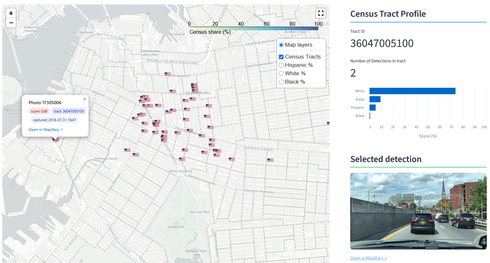

This app explores where American flags tend to be displayed in New York City using street-level imagery and object detection models to locate flags across the five boroughs.

Flag display is not evenly distributed across the city, but instead reflects broader social, economic, and political patterns. Flags may be more common in neighborhoods with higher rates of homeownership, specific racial or ethnic compositions, or strong partisan affiliations. They may also cluster around public institutions or civic spaces. This analysis provides a window into how symbols of national identity, such as the American flag are woven into the urban fabric of New York City, and how their display might reflect deeper narratives about belonging, pride, and politics.

---
#### Statistical Modeling

  
  
  

#### Software

  
  
  
  
  

#### Data

---

## Visit the app [here.](https://who-flies-the-flag.streamlit.app/._Map)

---
## Highlights

--