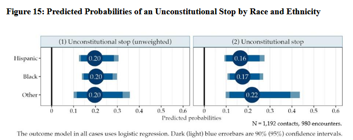

The study examined police encounters recorded by body-worn cameras (BWCs) between March 16 and May 15 of 2022. A team of retired New York State judges examined the recordings made by police officers and related documentation of those stopped by police, to determine their compliance with the Fourth Amendment, particularly as enunciated in the seminal Supreme Court case of Terry v. Ohio and the New York Court of Appeals case, People v. De Bour. Participating judges all had years of experience resolving Fourth Amendment search and seizure issues as trial or appellate judges, or both. The concurrence of two judges was required for the identification of an unreported stop or for a finding of constitutionality or unconstitutionality.
 


---

#### Statistical Modeling
<div style="display:flex; flex-wrap:wrap; gap:6px;">
  
  
  
  
</div>

#### Software
<div style="display:flex; flex-wrap:wrap; gap:6px;">
  
  
</div>

---

## Highlights

- **Data Engineering & Preprocessing**
    - Processed **1.5M+ BWC recordings** into structured encounters using metadata string matching and **hierarchical clustering** to merge multi-officer recordings of the same incident.
- **Sampling & Study Design**
    - Implemented **stratified random sampling** across encounter types (low-level, stops, arrests/summonses).
    - Conducted post-hoc **power analysis** and calculated **minimum detectable effect sizes (MDES)** to gauge statistical precision in subgroup and disparity analyses.
- **Feature Engineering from Unstructured Video**
    - Research assistants trained to apply systematic **content coding protocols** to extract event-level variables (officer actions, civilian engagement, encounter type).
    - Entity resolution of encounters by linking structured video metadata to administrative reports.
- **Ground-Truth Labeling & Reliability**
    - Retired judges coded stop constitutionality under **Fourth Amendment standards**.
    - Used **Cohen’s κ** to measure inter-rater reliability; applied majority-rule consensus for labels.
- **Statistical Modeling & Inference**
    - Fit **logistic regression models** to predict unconstitutional stops based on encounter conditions (e.g., self-initiated vs. call-driven, Neighborhood Safety Team presence).
    - Applied a **doubly robust estimation framework** using **entropy balancing** to adjust for covariate imbalance and strengthen inference.
    - Estimated uncertainty with **robust standard errors** and **95% confidence intervals**.


---

## Click here for the [full report.](https://www.nypdmonitor.org/wp-content/uploads/2025/05/2025.05.01-956-ISLG-Report-An-Examination-of-NYPD-Stop-and-Frisk-Practices.pdf)

---


## Citation

Chen, Annie Y., and Kathleen Doherty. 2025. An Examination of NYPD Stop and Frisk Practices: Using Body-Worn Camera Recordings to Determine the Constitutionality and Documentation of Street Stops. CUNY Institute for State and Local Governance. Research. https://www.nypdmonitor.org/wp-content/uploads/2025/05/2025.05.01-956-ISLG-Report-An-Examination-of-NYPD-Stop-and-Frisk-Practices.pdf.

```BibTeX
@article{
    fmp2025,
	author = {Chen, Annie Y. and Doherty, Kathleen},
    month = Apr,
	year = {2025},
	title = {An {Examination} of {NYPD} {Stop} and {Frisk} {Practices}: {Using} {Body}-worn {Camera} {Recordings} to {Determine} the {Constitutionality} and {Documentation} of {Street} {Stops}},
	institution = {CUNY Institute for State and Local Governance},
    publisher = {NYPD Monitor},
    url = {Denerstein - encounters that officers categorized as a low-leve.pdf:files/8403/Denerstein - encounters that officers categorized as a low-leve.pdf:application/pdf}}
```
