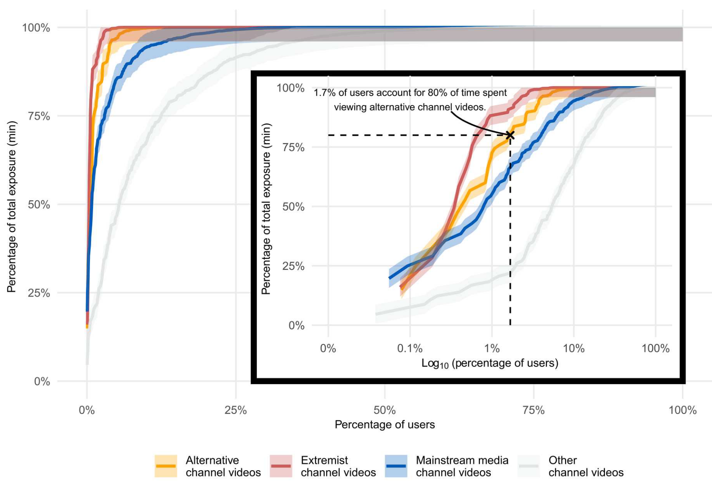

## Abstract

Do online platforms facilitate the consumption of potentially harmful content? Using paired behavioral and survey data provided by participants recruited from a representative sample in 2020 (n = 1181), we show that exposure to alternative and extremist channel videos on YouTube is heavily concentrated among a small group of people with high prior levels of gender and racial resentment. These viewers often subscribe to these channels (prompting recommendations to their videos) and follow external links to them. In contrast, nonsubscribers rarely see or follow recommendations to videos from these channels. Our findings suggest that YouTube’s algorithms were not sending people down “rabbit holes” during our observation window in 2020, possibly due to changes that the company made to its recommender system in 2019. However, the platform continues to play a key role in facilitating exposure to content from alternative and extremist channels among dedicated audiences.




---

#### Statistical Modeling
<div style="display:flex; flex-wrap:wrap; gap:6px;">
  
  
</div>

#### Software
<div style="display:flex; flex-wrap:wrap; gap:6px;">
  
  
  
</div>

---
## Highlights

---


## Citation

Chen, Annie Y., Brendan Nyhan, Jason Reifler, Ronald E. Robertson, and Christo Wilson. 2023. “Subscriptions and External Links Help Drive Resentful Users to Alternative and Extremist YouTube Channels.” Science Advances 9(35): eadd8080. doi:10.1126/sciadv.add8080.

```BibTeX
@article{chen_subscriptions_2023,
	title = {Subscriptions and external links help drive resentful users to alternative and extremist {YouTube} channels},
	volume = {9},
	url = {https://www.science.org/doi/10.1126/sciadv.add8080},
	doi = {10.1126/sciadv.add8080},
	abstract = {Do online platforms facilitate the consumption of potentially harmful content? Using paired behavioral and survey data provided by participants recruited from a representative sample in 2020 (n = 1181), we show that exposure to alternative and extremist channel videos on YouTube is heavily concentrated among a small group of people with high prior levels of gender and racial resentment. These viewers often subscribe to these channels (prompting recommendations to their videos) and follow external links to them. In contrast, nonsubscribers rarely see or follow recommendations to videos from these channels. Our findings suggest that YouTube’s algorithms were not sending people down “rabbit holes” during our observation window in 2020, possibly due to changes that the company made to its recommender system in 2019. However, the platform continues to play a key role in facilitating exposure to content from alternative and extremist channels among dedicated audiences.},
	number = {35},
	urldate = {2023-09-01},
	journal = {Science Advances},
	author = {Chen, Annie Y. and Nyhan, Brendan and Reifler, Jason and Robertson, Ronald E. and Wilson, Christo},
	month = aug,
	year = {2023},
	note = {Publisher: American Association for the Advancement of Science},
	pages = {eadd8080},
	file = {Chen et al_2023_Subscriptions and external links help drive resentful users to alternative and.pdf:files/6032/Chen et al_2023_Subscriptions and external links help drive resentful users to alternative and.pdf:application/pdf},
}
```
